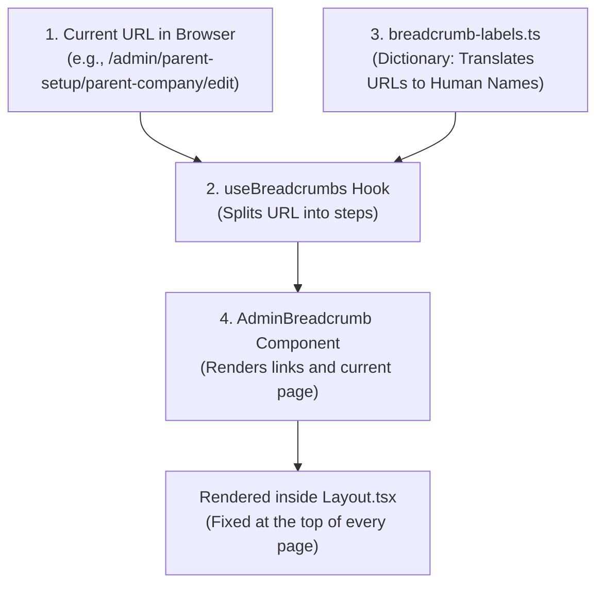

# How Breadcrumbs Work in Abreedo Web (Simple & Complete Guide)

This guide explains the entire breadcrumb system from top to bottom in simple terms. After reading this, you will understand exactly how every piece works and be able to explain it to anyone.

---

## 1. What is the Goal?

When a user navigates through nested pages in the app (for example, clicking into **Administration &rarr; Parent Company Setup &rarr; Update Current Parent Company**), they need:
1. **Context**: Knowing where they are in the application.
2. **Easy Navigation**: Being able to click on any previous step to jump straight back.
3. **Zero UI Jumping**: A fixed, smooth header that doesn't jump around when switching pages.

---

## 2. The 4 Pieces of the System

Our breadcrumb system is built using **4 simple, decoupled pieces**:



---

### Piece 1: The UI Primitives (`src/components/ui/breadcrumb.tsx`)
* **What it is**: The raw Shadcn UI HTML building blocks (`<nav>`, `<ol>`, `<li>`, `<Link>`, `<ChevronRight>`).
* **Analogy**: Like LEGO bricks. It only cares about colors, spacing, and accessible HTML tags. It knows nothing about routes or business logic.

---

### Piece 2: The Dictionary (`src/utils/breadcrumb-labels.ts`)
* **What it is**: The "translator" that turns raw URL paths into human-friendly titles.
* **How it resolves titles (3-Layer Priority)**:
  1. **Layer 1 (Specific Overrides - Highest Priority)**:
     - `/admin/parent-setup` &rarr; `"Administration"`
     - `/admin/parent-setup/parent-company/edit` &rarr; `"Update Current Parent Companies"`
     - `/admin/parent-setup/carriers/new` &rarr; `"New Carrier"`
  2. **Layer 2 (Sidebar Match)**:
     - Automatically scans `adminSidebar` and `employeeSidebar` titles to ensure breadcrumbs always match the sidebar menus.
  3. **Layer 3 (Auto-Humanizer - Fallback)**:
     - If a route isn't listed, it automatically turns hyphenated words like `open-enrollment` into `"Open Enrollment"`.
  4. **Path Aliasing**:
     - Automatically redirects intermediate dummy routes (like `/admin/parent-setup/coverage-codes`) to the actual hub (`/admin/parent-setup/carriers`).

---

### Piece 3: The Trail Builder Hook (`src/hooks/common/use-breadcrumbs.ts`)
* **What it is**: A custom React hook that tracks the browser URL using TanStack Router and builds the breadcrumb list.
* **How it builds the trail**:
  1. Reads the current URL: `/admin/parent-setup/parent-company/edit`.
  2. Splits it into segments: `['admin', 'parent-setup', 'parent-company', 'edit']`.
  3. Skips the internal layout prefix `admin`.
  4. Progressively accumulates the URL paths:
     - Step 1: `/admin/parent-setup` &rarr; Asks Dictionary &rarr; Label: `"Administration"`, Link: `/admin/parent-setup`.
     - Step 2: `/admin/parent-setup/parent-company` &rarr; Asks Dictionary &rarr; Label: `"Parent Company Setup"`, Link: `/admin/parent-setup/parent-company`.
     - Step 3: `/admin/parent-setup/parent-company/edit` &rarr; Asks Dictionary &rarr; Label: `"Update Current Parent Companies"`, Link: `undefined` (because it is the current active page).
  5. Returns the complete array of items:
     ```ts
     [
       { label: "Administration", href: "/admin/parent-setup" },
       { label: "Parent Company Setup", href: "/admin/parent-setup/parent-company" },
       { label: "Update Current Parent Companies", href: undefined }
     ]
     ```

---

### Piece 4: The Shared Layout (`src/components/Layout.tsx`)
* **What it is**: The common shell of the app containing the top Navbar, left Sidebar, and right content area.
* **Why it's placed here**:
  - Instead of adding `<AdminBreadcrumb />` inside 20+ individual page files, it sits in **one single spot** inside `Layout.tsx` above `<Outlet />`.
  - **Result**: The breadcrumb stays in a fixed position across the entire application. When you navigate between pages, the breadcrumb smoothly updates in place without jumping or shifting layout.

---

## 3. Real-Life Step-by-Step Walkthrough

Let's walk through what happens when a user opens the **Update Current Parent Company** page:

| Step | Action | What Happens Under the Hood | Result on Screen |
| :--- | :--- | :--- | :--- |
| **1** | User clicks "Update Current Parent Company" | Browser URL changes to `/admin/parent-setup/parent-company/edit` | Router updates |
| **2** | `Layout.tsx` re-renders | `<AdminBreadcrumb />` asks `useBreadcrumbs()` for the trail | Hook calculates trail |
| **3** | Hook splits segments | Splits into `/admin/parent-setup`, `.../parent-company`, `.../edit` | 3 distinct steps |
| **4** | Hook queries Dictionary | Translates each segment to its human-readable title and resolved URL link | Labels resolved |
| **5** | Component renders UI | - First 2 items rendered as clickable blue/tan links.<br/>- Final item rendered as active text. | `Administration > Parent Company Setup > Update Current Parent Companies` |
| **6** | User clicks "Administration" | Browser navigates directly back to `/admin/parent-setup` hub | Instant return |

---

## 4. Why This is "Senior Engineer" Architecture

1. **Zero Duplicate Code (DRY)**:
   - You don't write breadcrumb code in individual page files. Pages stay 100% focused on their own form/table content.
2. **Single Source of Truth**:
   - If a page title or route changes in the future, you edit it in **one line** in `breadcrumb-labels.ts`, and every breadcrumb in the app updates automatically.
3. **Decoupled Architecture**:
   - UI styling is separated in `breadcrumb.tsx`.
   - Business/routing logic is separated in `use-breadcrumbs.ts`.
   - Content strings are separated in `breadcrumb-labels.ts`.
4. **Resilient to 404s (Path Aliasing)**:
   - Intermediate paths (like `/coverage-codes`) automatically map to their real parent hubs (`/carriers`), preventing dead links.

---

## 5. Quick 30-Second Summary to Teach Anyone

> *"Our breadcrumbs work automatically: TanStack Router tells our custom hook the current URL path. The hook splits the path into progressive steps, looks up human-readable names from our dictionary (`breadcrumb-labels.ts`), and gives clickable links to ancestor pages and active text to the current page. Because it is rendered inside our shared `Layout.tsx`, it stays in a fixed top position across all pages without any layout shifts."*
